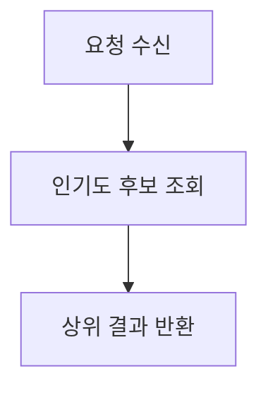
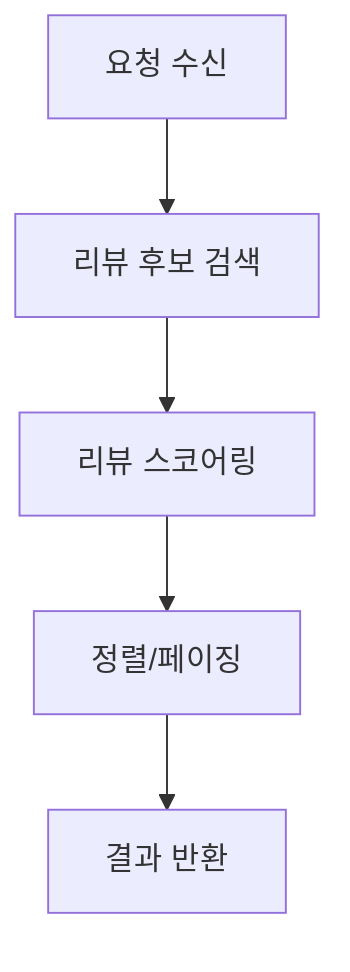
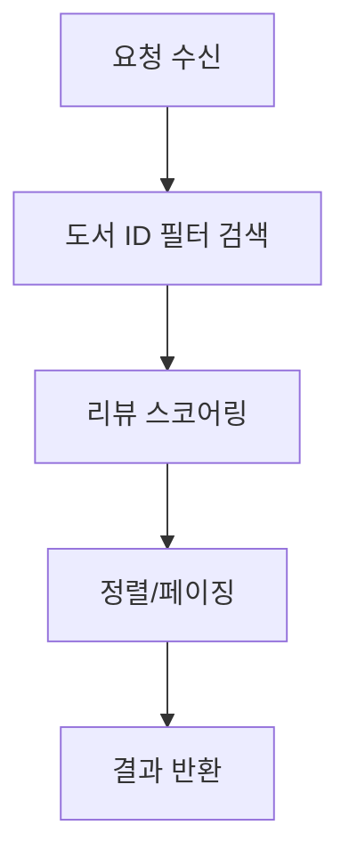
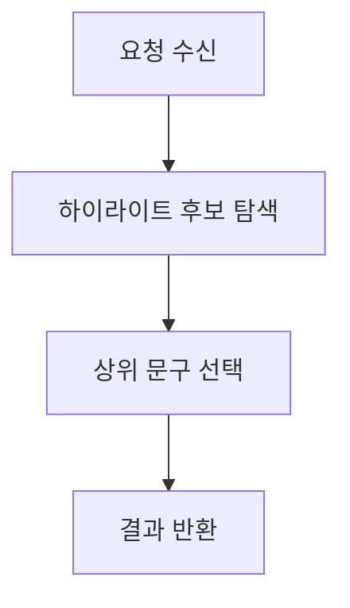
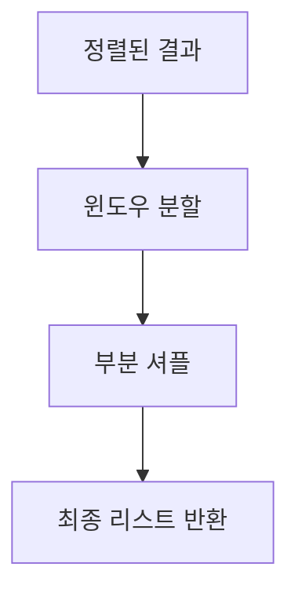
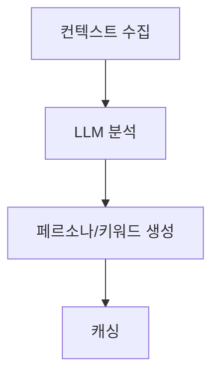
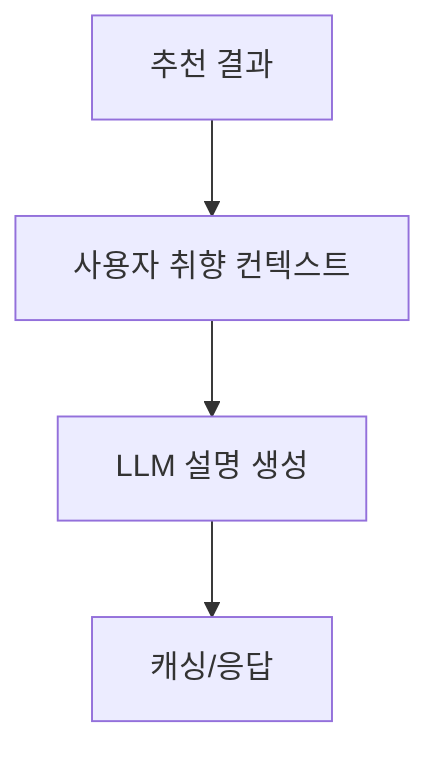

현재 진행중인 **bookvoyage** 프로젝트에서 가장 큰 모듈이자 기능인 *추천시스템* 을 어떻게 만들었고, 어떤 기준으로 만들었는지,  
어디까지는 감안하고 어디서부터 포기(다르게는 트레이드오프 ㅎㅎ) 했는지에 대해 남겨볼 생각이다.  

우선 목표는 개인화 추천 시스템이고, 현재 아주 많은 소셜 플랫폼이나 OTT, 소셜 커머스 등에서 아주 많이 사용되는 기능임.  
특히 요즘엔 AI까지 덧대어서 더더더 고도화 되어가고 있다.  

내가 이런 모든 현재의 트렌드와 기술 최전선에 있는 것들까진 감안하지 못했음.  

주로 참고한 서적은 **Recommender Systems: The Textbook** 이고, 다 읽고 진행한 것도 아님. 전체적으로 개념만 파악하고 바로 진행했다.   
그래서 스스로 평가하는 기준도 저 책을 기준으로 해볼 것임.  

---

## 한 줄 요약
BookVoyage는 Neo4j + Elasticsearch를 결합한 하이브리드 추천 시스템으로 실시간 이벤트를 Redis ZSET에 반영해 다음 요청부터 즉시 정렬에 영향을 주는 구조다.

---

## 1) 목표와 원칙
- 개인화 추천의 품질과 실시간 반응성을 동시에 확보
- 배치 기반 학습/동기화는 유지하면서도 사용자 행동은 즉시 반영
- 모듈화된 구성으로 확장/튜닝이 쉬운 구조

---

## 2) 시스템 구성 개요

**데이터 소스**
- **MySQL**: SoT (Source of Truth)
- **Neo4j**: 사용자-도서 관계 그래프 (CF)
- **Elasticsearch**: 텍스트/콘텐츠 기반 검색 (CB)
- **Redis**: 추천 캐시 및 실시간 점수 반영

**추천 파이프라인**
1. 후보 생성
2. 스코어링
3. 캐싱 및 샘플링
4. 결과 반환

---

## 3) 지원 기능 요약

| 기능 | 설명 | 데이터 소스 |
|------|------|------------|
| 사용자 맞춤 도서 추천 | CF + CB 기반 개인화 추천 | Neo4j + Elasticsearch |
| 비로그인 사용자 추천 | 인기도 기반 추천 | Elasticsearch |
| 피드용 리뷰 추천 | 전체 리뷰 중 사용자 맞춤 추천 | Elasticsearch |
| 도서별 리뷰 추천 | 특정 도서의 베스트 리뷰 | Elasticsearch |
| 리뷰 하이라이트 추천 | 인상적인 리뷰 문구 추천 | Neo4j |
| 윈도우 샘플링 | 다양성 확보를 위한 동적 셔플링 | Redis Cache |
| AI 사용자 취향 분석 | LLM 기반 독서 페르소나 자동 생성 | OpenAI + Redis Cache |
| AI 추천 설명 생성 | 각 추천에 대한 자연어 설명 자동 생성 | OpenAI + Redis Cache |

---

## 4) 후보 생성 (Candidate Generation)

### Neo4j (그래프 기반)
- Collaborative Filtering
- Genre / Author / Topic 기반 확장
- 유사 사용자 및 k-hop 이웃 탐색

### Elasticsearch (콘텐츠 기반)
- **Popularity**: 인기 도서 기반 후보
- **MLT (More Like This)**: 유사 도서 탐색
- **Semantic**: 검색어 기반 콘텐츠 유사도

**시드 전략**
- 최근 검색어, 최근 리뷰/서재 업데이트를 활용해 MLT/시맨틱 후보를 생성
- 시드가 부족할 경우 인기 후보로 보강

---

## 5) 하이브리드 스코어링

도서 추천의 최종 점수는 다음 가중치로 계산한다.

```plain
FinalScore =
  GraphScore(0.40) +
  SemanticScore(0.30) +
  PopularityScore(0.10) +
  FreshnessScore(0.05)
```

**의도**
- Graph/Content의 균형을 유지하면서
- 전역 인기와 신선도를 보완적으로 반영

---

## 6) 실시간 반영 구조 (ZSET 단일 경로)

사용자 행동 이벤트는 Kafka를 통해 소비되고, 추천 캐시의 ZSET 점수를 즉시 업데이트한다

```plain
Event → RecommendationTrackingEventHandler
     → Redis ZINCRBY (recommend:user:{userId})
```

**핵심 효과**
- 다음 추천 요청 시 즉시 정렬 반영
- “실시간 반영” 경로를 ZSET 하나로 단순화

---

## 7) 캐싱과 샘플링

**캐시**
- 추천 결과는 Redis ZSET에 저장 (TTL 3시간)
- 상위 N개를 유지해 응답 속도 확보

**샘플링**
- Window Sampling으로 상위 결과의 품질을 유지하면서 다양성 확보
- 작은 윈도우 단위로 부분 셔플 적용

---

## 8) 기능별 플로우차트

### 8.1 사용자 맞춤 도서 추천
```mermaid
flowchart TD
  A[요청 수신] --> B{비로그인?}
  B -- 예 --> C[인기도 기반 기본 추천]
  B -- 아니오 --> D{캐시 존재?}
  D -- 예 --> E[Redis ZSET 조회]
  D -- 아니오 --> F[후보 생성]
  F --> G[Neo4j 후보]
  F --> H[Elasticsearch 후보]
  G --> I[중복 제거]
  H --> I
  I --> J[하이브리드 스코어링]
  J --> K[Redis ZSET 캐싱]
  K --> L[정렬/페이징]
  E --> L
  L --> M[샘플링(옵션)]
  M --> N[결과 반환]
```
CF/CB 후보를 합쳐 점수를 계산하고, Redis 캐시에 저장해 재사용한다. 실시간 이벤트는 ZSET 점수를 갱신해 다음 요청부터 바로 정렬에 반영된다.

### 8.2 비로그인 사용자 추천

로그인이 없을 때는 전역 인기도를 기반으로 빠르게 결과를 반환한다.

### 8.3 피드용 리뷰 추천

리뷰 피드에서는 최신성/인기도/참여도 등을 조합해 사용자의 피드 품질을 유지한다.

### 8.4 도서별 리뷰 추천

특정 도서 안에서 “베스트 리뷰”를 뽑기 위해 동일한 스코어링 체계를 적용한다.

### 8.5 리뷰 하이라이트 추천

리뷰의 핵심 문구를 선별해 콘텐츠 소비 경험을 강화한다.

### 8.6 윈도우 샘플링

상위 품질을 유지하면서도 다양성을 확보하기 위한 단계적 셔플 전략이다. (넷플이 이렇게함)

### 8.7 AI 사용자 취향 분석

사용자 활동 데이터를 요약해 추천 설명과 개인화에 활용한다.

### 8.8 AI 추천 설명 생성

추천 이유를 자연어로 생성해 UX 이해도를 높인다.

---

# 평가
내부적으로 아주 상세한... 문서가 있지만 너무 구체적으로 구현 세부 사항에선 이글에선 정리 안했음.  
위와 같은 내용을 기반으로, 추천 시스템을 자가 평가 해보자. 앞서 말했듯 평가기준은 내가 읽은 책임.  

### 1. Neighborhood-Based Collaborative Filtering
> 적극적으로 사용하고자 했음 / 구현은 그래프 기반 변형

- User-based CF는 맞음
- Neighborhood 개념 확실함
- 벡터 KNN은 아님

실제 구현은 Neo4j 그래프로 처리함. 공통 BOOK → USER → BOOK 경로로 이어짐. 
- k-hop / 공통 이웃 수 / 관계 타입 으로 처리.

전통적으로는 벡터 KNN CF를 사용하지만 그리하지 않고 Neoj4의 그래프 기반 Neighborhood CF를 사용함.  

### 2. Model-Based Collaborative Filtering
> 사용 안함

이는 일반적으론 데이터를 모델(수학적/ML 모델 등)을 통해 잠재적으로 패턴 분석하는 것임.  
사용자-아이템 행렬을 낮은 차원의 행렬로 분해해서 처리하는 `Matrix Factorization`이 표준방법이라고 한다.  
아니면 요즘은 딥러닝도 많이 사용함. 실제 업계에서 본적은 없지만 현재 기조를 보면 이 구조가 기본일 것 같음.  

### 3. Content-Based Recommender Systems
> 사용함 / 다층구조로 구성

- 장르 / 저자
- 텍스트기반 (MLT, TF-IDF)
- 사용자 프로파일 기반 반영

현재 구현이
- Neo4j: 구조적 CB
- Elasticsearch: 의미적 CB
- Scorer 분리

이므로 그렇게 생각함.

### 4. Knowledge-Based Recommender Systems
> 부분적 / 약함

- 명시적 규칙 엔진 없음
- 제약 기반 추천 없음
- 휴리스틱 가중치가 맞음

내부에서
- Popularity / Freshness는 규칙이라고 볼 수 있는데,
- 하지만 “조건 만족” 기반 추천은 아님

Knowledge-based라 부르기엔 약하다. 그냥 보조 규칙 수준..?  

### 5. Ensemble-Based & Hybrid Recommender Systems
> 사용

해당 여부는 다음과 같음
- CF + CB + Popularity + Freshness
- Weighted Hybrid
- Two-stage 구조

내부 구현이 다음과 같음
- Candidate Generation 분리
- Modular Scorer
- Configurable weight

### 6. Evaluating Recommender Systems
> 기반은 고려중이지만, 현재는 미비

- 로그는 수집함
- Offline replay 불가
- AB TEST 불가

테스트 사항에선 계획 중이긴 하지만.. 고려만 하고 있음  
확정적으로 진행될지도 미지수..  
확실한건 지금 "평가가 가능한 시스템"이 구축되진 않았다는 것 

### 7. Context-Sensitive Recommender Systems
> 미사용

이는 일반적으로, 시간대/디바이스/세션에 따라 다르게 추천하는걸 의미하는데,  
현재는 내부적으로 동일 컨텍스트를 사용함.

### 8. Time- & Location-Sensitive Recommender Systems
> Time 만 "일부" 고려

시간은 보너스 점수로 사용중, 근데 컨텍스트 아님

“시간 가중치” 수준이라고 보면 될듯? Time-aware라 부르긴 부족하다.  

### 9. Structural Recommendations in Networks
> 해당한다고 생각

해당 여부
- 그래프 탐색
- k-hop
- 다중 노드 타입

내부 구현
- Neo4j 중심
- 구조 기반 추천 설계

### 10. Social & Trust-Centric Recommender Systems
> 사용 안함

팔로우 개념은 있음. 근데 추천 시스템에 끌어와서 사용하고 있지는 않는다.  

### 11. Attack-Resistant Recommender Systems
> 사용 안함

해당 여부
- Shilling 방어
- 이상치 탐지

등의 보호로직이 없음. 


---

내가 만약 데이터 분석이나 AI 개발자였다면 해당 부분으로 더 보완 및 고도화를 해야겠지만, 사실 내 주분야는 아니라고 생각함.  
그래서 테스트나 보안쪽은 조금 더 개선해볼테지만, 내부 시스템 자체는 이정도 수준에서 만족하고 개인 프로젝트로 마칠 것 같다.  

그럼에도 불구하고 굳이 이렇게 정리해둔 이유는, 스스로가 뭘 했고 뭘 안하고 뭘 모르는지 파악하기 위해서이다.  

이번에 정리하면서 성능적으로 더 개선할 부분이 보여서 다음에 만약 추가적으로 글을 쓴다면 성능 튜닝에 관한 글이 될 것 같다.  
추천 시스템(특히 대기업/대규모)을 찾아보면서 해당 부분이 BI, BM, 마케팅과도 생각보다도 더 밀접한 관련이 있고 기술적으로도 풀어갈 방법이나 답안, 발전 방향도 많은 분야라는 생각이 들긴 했다.  

